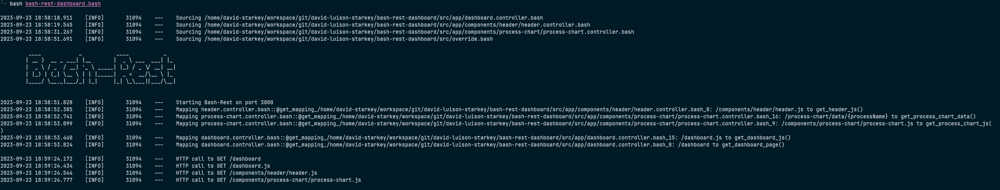
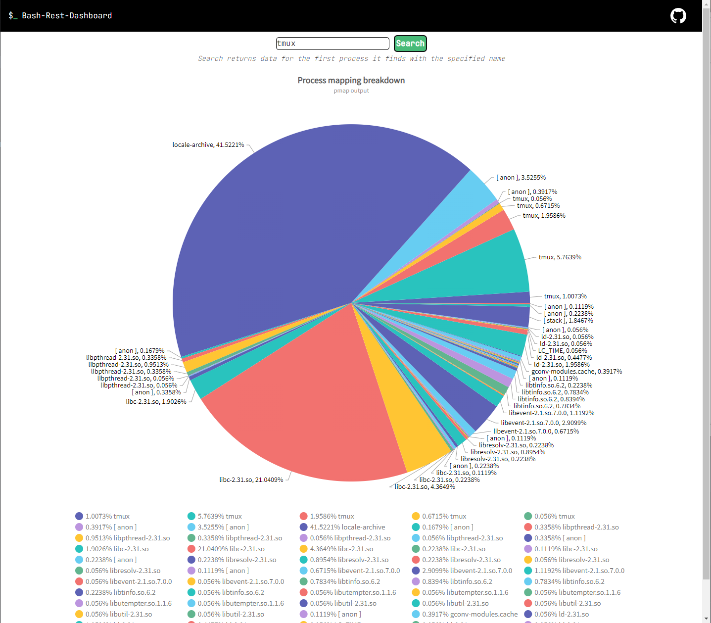

# bash-rest-dashboard

---

    <h4>
        Basic admin dashboard built using <code>bash-annotations</code> and <code>bash-rest</code>
    </h4>

---

## Introduction

A simple dashboard built using bash-annotations and bash-rest.

`*.controller.bash` files contain endpoint mapping annotations and their respective functions whenever a http request is made to a mapped endpoint.

Controller files and endpoint-function mapping occur at runtime, leading to an initially slow startup.

## Usage

Run `bash bash-rest-dashboard.bash` and open up the browser to `http://localhost:3000/dashboard`.

Search for processes and get a pie chart representation of `pmap ${PID}` for said process.

Output is of the first process found of that name. Some characters (e.g. '/') cannot be searched for.

